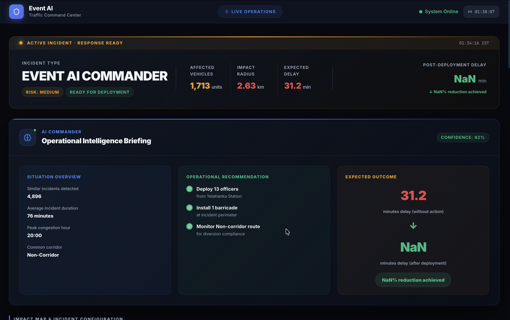
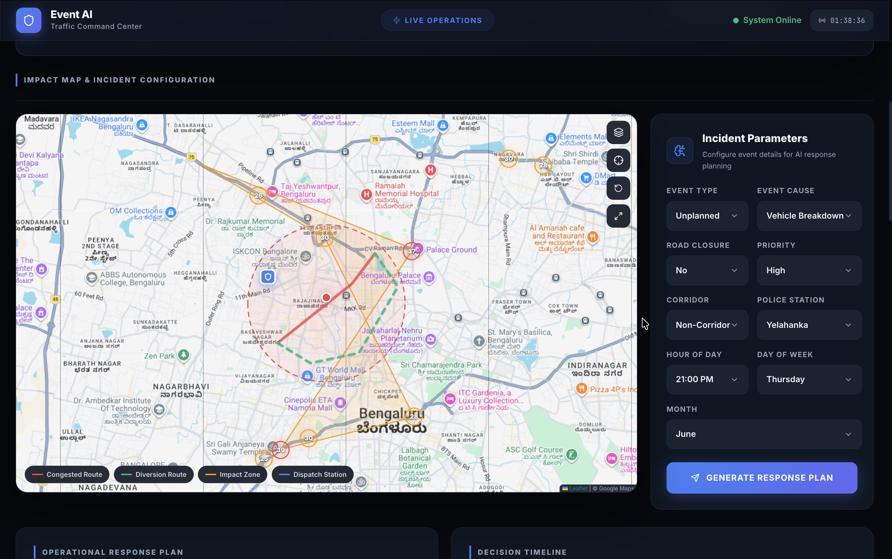
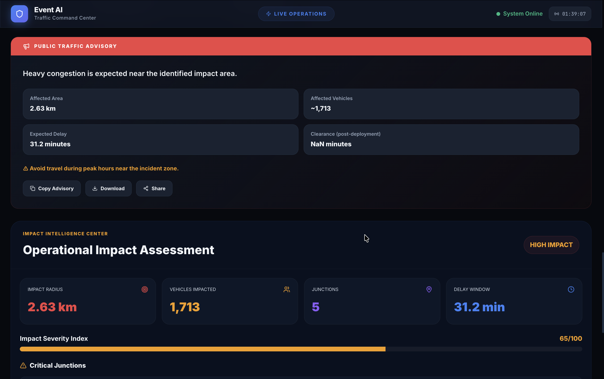
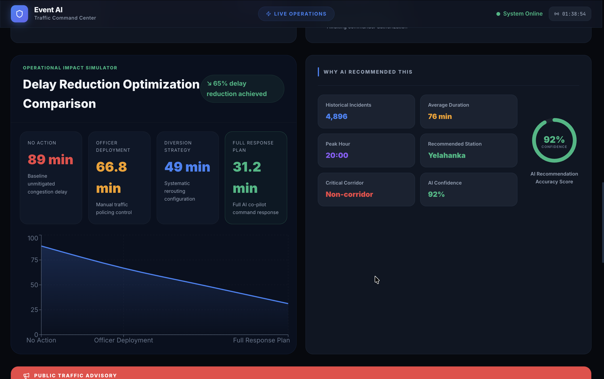

# 🛡️ Event AI Command Center

> **AI-Powered Traffic Intelligence & Operations Platform**

Event AI is an advanced, enterprise-grade command center application built for operations and emergency response in Bengaluru.

---

## ✨ Key Features

- **Spatial Visualization Map**: Real-time Interactive mapping with hotspots, epicenters, optimal police stations, and multi-layer rendering .

- **AI Commander Copilot**: Generates automated tactical operations directives, risk evaluations, and exact officer/barricade deployment counts based on incident parameters.

- **Delay Mitigation Simulation**: Models the statistical impact of "No Action" vs "Diversions" vs "Full Response" to visualize efficiency gains.

- **Impact Zone Analysis**: Calculates affected vehicular counts, radial impact, and dynamically renders polygon bounds of traffic disruptions.

- **Historical Context**: Tracks baseline incident distribution by cause and geographic zone to provide operational context.

---

## 🛠️ Technology Stack

**Frontend (Client)**
- **Framework**: React 18 + Vite
- **Language**: TypeScript
- **Styling**: Tailwind CSS, CSS Variables (Custom Design System)
- **Animations**: Framer Motion
- **Data Visualization**: Recharts, React-Leaflet
- **State/Fetching**: React Query, Axios

**Backend (Server & AI)**
- **Framework**: Python FastAPI
- **Data Processing**: Pandas, Scikit-Learn
- **Server**: Uvicorn

---

## 🚀 Getting Started

Follow these instructions to get the project up and running on your local machine.

### Prerequisites
- Node.js (v18+)
- Python (3.9+)

### 1. Start the Backend API

Open your terminal and navigate to the backend directory:

```bash
cd backend

# Create a virtual environment (optional but recommended)
python3 -m venv venv
source venv/bin/activate  # On Windows use `venv\Scripts\activate`

# Install dependencies
pip install -r requirements.txt

# Configure Environment Variables
# Create a .env file in the backend directory and add your Groq API key:
# GROQ_API_KEY=your_groq_api_key_here

# Run the FastAPI server
uvicorn main:app --reload --port 8000
```
*The backend will now be running at `http://localhost:8000`*

### 2. Start the Frontend Application

Open a **new** terminal window and navigate to the frontend directory:

```bash
cd frontend

# Install Node modules
npm install

# Start the Vite development server
npm run dev
```
*The application will now be running at `http://localhost:3000`*

---

## 📸 Demo Gallery


| Tactical Dashboard Overview | Spatial Map & Analytics |
|:---:|:---:|
|  |  |
| *High-level view of active operations and historic KPIs.* | *Multi-layer geospatial tracking of congestion epicenters.* |

<br/>

| Advisory Section | Mitigation Simulation Modeling |
|:---:|:---:|
|  |  |
| *Automated deployment protocols and risk assessments.* | *Visualizing the efficiency of dispatching units vs no action.* |

---

## 📂 Project Structure

```text
EventAi/
├── backend/                  # Python FastAPI server
│   ├── main.py               # API endpoints & routing
│   ├── schemas.py            # Pydantic data models
│   ├── services/             # Prediction & ML logic
│   └── models/               # Serialized ML models
├── frontend/                 # React frontend
│   ├── src/
│   │   ├── components/       # Reusable UI (Cards, Charts, Map)
│   │   ├── hooks/            # React Query API hooks
│   │   ├── pages/            # Main views (Dashboard)
│   │   ├── types/            # TypeScript interfaces
│   │   └── utils/            # Formatters and constants
│   ├── index.css             # Global design system tokens
│   └── vite.config.ts        # Vite configuration & proxy
└── training/                 # Model training scripts & notebooks
```

---

*Designed and developed for high-stakes urban traffic intelligence.*
